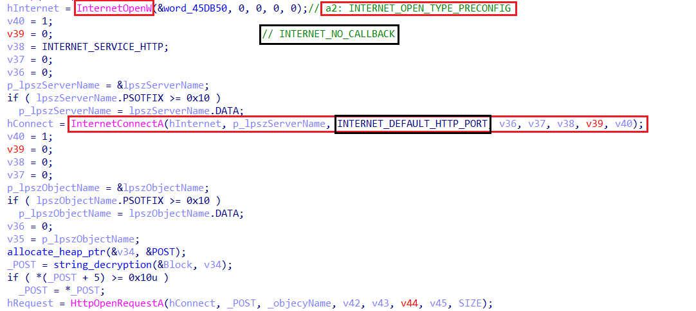
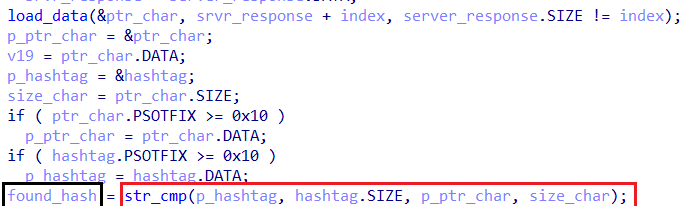
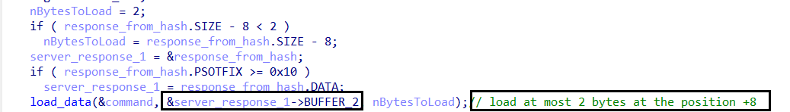

# Amadey in nutshell

Amadey is a malware loader first discovered in 2018, primarily used by cybercriminals to deploy additional payloads onto infected systems. Known for its simplicity and efficiency, Amadey enables threat actors to distribute stealers, banking trojans, and ransomware while maintaining a low detection footprint. It is often distributed through phishing emails, exploit kits, or malicious spam campaigns. Unlike more advanced botnets, Amadey focuses on stealth and persistence, making it a valuable tool for cybercriminals. Recently, Amadey has been observed distributing RedLine Stealer and Vidar Stealer, commonly used in credential theft and financial fraud. The loader is also leveraged by Russian-speaking underground forums, making it a persistent threat in cybercrime operations. [In online interview](https://g0njxa.medium.com/approaching-stealers-devs-a-brief-interview-with-amadey-56c8c6ea0ad6), Amadey's author clears that he developed this malware because `SmokeLoader` didn’t meet the requirements of his work and developed his own tool. That’s why Amadey was created.

# Tech Summary

- **Host Profiling**: Before executing its main payload, Amadey collects detailed system information to profile the infected host. This includes OS version, user privileges, antivirus status, system architecture, domain membership, and computer name. The gathered intelligence allows Amadey to adapt its behavior, evade execution in certain environments (e.g., sandboxes), and tailor payload delivery based on system defenses and privileges.

- **Configuration Extraction**: Amadey employs a custom Base64 encoding scheme to secure its configurations. The encrypted configurations are initially stored in the .rdata section and are dynamically decrypted into memory only when needed. This decryption process involves custom Base64 translation and key-mapped decryption, ensuring that configurations remain hidden from static analysis. The extracted data includes command-and-control (C2) addresses, execution parameters, and persistence settings.

- **C2 Communication**: Amadey communicates with its C2 infrastructure using WinINet APIs, leveraging encrypted HTTP requests to maintain stealth. The malware first sends host profiling data to the server, after which it retrieves and decrypts commands to determine its next actions. If the malware does not receive a response, it clears memory, sleeps for a predefined interval, and reconnects, ensuring persistence in communication.

- **Payload Deployment**: Amadey supports multiple payload execution methods, giving threat actors flexibility in attack strategies. It can download and execute EXE/DLL payloads, including ransomware or banking trojans. Inject shellcode into legitimate processes to evade detection, Drop secondary malware components in hidden system directories ,and Modify registry keys (RunOnce) and create scheduled tasks to maintain execution across reboots.

- **Malicious Code Execution**: Amadey ensures the execution of its payloads using various techniques: Process injection into suspended processes for stealth execution, Unmapping legitimate executables and replacing them with malicious code using NtUnmapViewOfSection, Scheduled Task creation using the COM interface, avoiding schtasks.exe detection ,and Re-executing itself from the Temp directory if not already running from there

# Analysis

## Initial Triage

| Field                          | Value                                                                      |
|--------------------------------|-----------------------------------------------------------------------------|
| File Type            |PE32+ executable (GUI) x86-64, for MS Windows                                  |
|File Size             |591.23 KiB          |
| MD5                  | 4EC4CA62CD91B6E9DDD4327DB8A36BFE            |
| SHA1                 | 8FC4B3C9E628F3368EE50186806C5790D0E68C21    |
| SHA256               | A00ED97F90DA21D37AA31B844C2F7CDE66C7CAE5A70AD60310D7F1F671360C16                                       |

**In the initial stage of analysis**, I got the sample with hash [`MD5: 4EC4CA62CD91B6E9DDD4327DB8A36BFE`](https://bazaar.abuse.ch/sample/a00ed97f90da21d37aa31b844c2f7cde66c7cae5a70ad60310d7f1f671360c16/), static techniques were sufficient to examine the sample. Loading the file into `Detect It Easy (DIE)` revealed that it contained a compressed `RAR` archive. Upon extracting this archive, three files were found:

- `book.exe` – A suspicious executable
- `book.xlsx` – A decoy Excel spreadsheet
- `luncher.bat` – A batch script responsible for execution

### Behavior of the Batch Script

The batch script `(luncher.bat)` behavior Includes executing only three lines of code:

```bash
start "" "book.exe"
start "" "book.xlsx"
del "%~f0"
```

Its purpose is straightforward:

- It launches book.exe, initiating the malicious payload.
- It opens book.xlsx, likely to divert suspicion and make execution appear legitimate.
- It self-deletes to remove traces of execution.

## Unpacking and Identifying the Payload

To further investigate,I uploaded the sample to unpac.me, which successfully unpacked the payload. The unpacked executable was identified as Amadey malware, with the same hash as book.exe extracted earlier using `DIE`.
This strongly suggests that the first stage functions as a packer or dropper, designed to deliver and execute Amadey while maintaining stealth. The batch script facilitates execution while erasing evidence, a common tactic in malware deployment.

I've uploaded the sample to traige sandbox and from the dynamic behaviour and the [triage report](https://tria.ge/250205-r4g1nasnem/behavioral1) clear that this intial sample only drops the three files and run the batch script and the file `book.exe` does all the work.

From this point, I give all my attention to the file `book.exe` and the coming analysis is all about it.

| Field                       |Value                                                   |
|-------------------|-----------------------------------|
| File Name| **book.exe** |
|File size| 429.00 KiB|
|File Type| PE32 executable (GUI) Intel 80386, for MS Windows|
|MD5| DAA3F1F23DDDF4CF413B75E3F2A75DF7|
|SHA1| 0398FF609DCF5B8E0D580FBB4C68E8511EF8880B|
|SHA256|7F8FC4871723C0813A17E211D62CB069764E5B5A692852616DF82E7F3A2EFB2A|

## Host profiling

During the analysis of the malware sample, it was observed that it collects various system attributes to profile the infected host. This information helps the malware determine the system's characteristics and decide on further actions, such as evading detection, executing payloads, or tailoring attacks.

Extracted Host Profiling Parameters
The malware collects the following system-related information:

|Identifier|Value|
|--|---|
|id | Unique identifier of the infected system, possibly generated based on hardware and user-specific values.|
|os | Operating system version, used to determine compatibility with malware execution.|
|vs | Version of the malware or related software on the system.|
|pc | Computer name, which can be used for identification or network-based attacks.|
|sd | System directory path, potentially used for storing malicious files or persistence.|
|av | Installed antivirus software, useful for evasion techniques.|
|bi | Build information of the system, which may indicate specific Windows distributions or architectures.|
|ar | Administrator rights status, determining whether the malware runs with elevated privileges.|
|lv | Additional malware installed on infected machine.|
|og | Organization or domain name, often extracted for targeting enterprise environments.|
|un | Current username, useful for determining access levels and privileges.|
|dm | Domain membership status, relevant for targeting corporate networks.|

### Implications of Host Profiling

By gathering this data, the malware author gains a deeper understanding of the infected environment. This intelligence allows it to:

- Adapt behavior based on the operating system and security measures.
- Avoid execution on certain machines to evade analysis.
- Target specific organizations or regions.

## Persistence

During the analysis of the malware sample, it was observed that it establishes persistence using Windows Scheduled Tasks. This technique ensures that the malware remains active even after a system reboot or user logoff, allowing it to maintain control over the infected machine.

### Scheduled Task and Job Creation

#### Scheduled Task via COM Interface

The malware establishes persistence by creating a **Scheduled Task using the Task Scheduler COM API** instead of traditional methods like schtasks.exe or registry modifications. By leveraging hardcoded **CLSIDs** and **RIIDs**, specifically **CLSID** `{148BD52A-A2AB-11CE-B11F-00AA00530503}` (representing `ITaskScheduler`)


and **RIID** `{148BD527-A2AB-11CE-B11F-00AA00530503}` (representing `ITask`),


the malware interacts directly with the Task Scheduler service. This technique enables stealthy execution and evasion from detection mechanisms that monitor command-line activity.

Once initialized, the malware creates a scheduled task that executes a malicious malware copied to the Temp directory, typically found at:
`C:\Users\<Username>\AppData\Local\Temp\Gxtuum.exe`

The task is configured to run at system startup or user logon, ensuring persistence across reboots. To make the task less noticeable in the Task Scheduler UI. By using **`CoCreateInstance`** to instantiate `ITaskScheduler` and `ITask`.
The malware first checks wether it runs from the **Temp** or another folder.


If it runs from the **Temp** ignore the task creation and if not it creates the task


The malware programmatically creates and registers the task without invoking external processes, making it harder to detect through standard security monitoring.


And if the creation failed, the malware checks the error signal and if the error is `0x80070050` which means `"A file or object with the specified name already exists."`, the malware deletes the task and recreates it.


This persistence mechanism poses a significant challenge for detection and mitigation, as it bypasses command-line monitoring and process-based detection. However, defenders can identify this behavior by auditing `Scheduled Task entries`, monitoring for unusual `COM object instantiations`, and inspecting the `Temp directory` for unauthorized executables. Removing the malicious task requires using `schtasks /delete` or PowerShell’s `Unregister-ScheduledTask` command.

#### Job Creation

The malware also creates a job associated with the scheduled task, likely serving as a wrapper for executing additional commands or payloads in a controlled manner. This job-based execution may be intended to:

- Maintain stealth by running within a legitimate process.
- Ensure reliable execution of the malware.
- Bypass certain security mechanisms that might block standalone execution.


#### Task Execution & Persistence

Once the scheduled task is created, it will:

- Run at system startup, on user logon, or at specified intervals.
- Invoke the malicious payload, ensuring continued infection.
- Potentially execute with elevated privileges if the task was configured to run as an administrator.

#### The Made Task Info

```
Folder: \
HostName:                             xxxxxxx-xxxxxxx
TaskName:                             \Gxtuum
Next Run Time:                        x/xx/xxxx x:xx:xx XX
Status:                               Ready
Logon Mode:                           Interactive only
Last Run Time:                        x/xx/xxxx x:xx:xx XX
Last Result:                          0
Author:                               xxxxxxx-xxxxxxx\<UserName>
Task To Run:                          C:\Users\<UserName>\AppData\Local\Temp\cca1940fda\Gxtuum.exe 
Start In:                             N/A
Comment:                              N/A
Scheduled Task State:                 Enabled
Idle Time:                            Disabled
Power Management:                     
Run As User:                          xxxxxx
Delete Task If Not Rescheduled:       Disabled
Stop Task If Runs X Hours and X Mins: 72:00:00
Schedule:                             Scheduling data is not available in this format.
Schedule Type:                        One Time Only, Minute 
Start Time:                           x:xx:xx XX
Start Date:                           x/xx/xxxx
End Date:                             N/A
Days:                                 N/A
Months:                               N/A
Repeat: Every:                        0 Hour(s), 1 Minute(s)
Repeat: Until: Time:                  None
Repeat: Until: Duration:              87600 Hour(s), 0 Minute(s)
Repeat: Stop If Still Running:        Disabled
```

### Copy into *Temp*

After achieving persistence, the malware ensures that it's running from the **Temp Folder** and if not copy itself there and lunch up from there and exits the current process.

- It first get the **Temp Folder** path.

- Concatinating to it the desiered folder to contain our malware which is `cca1940fda`.
- Adding to the path the desiered name for the malware to be run as `Gxtuum.exe`.
  


- It then gets the file name and path using `GetModuleFileNameA` API.
  


- Compares between these to paths and if compatable move on, if not:
  - Check if there is any directory with the name `cca1940fda` and if yes, tries to open the malware at the reading mode:
    - If can open it which mean it's already exists there:
      - Excute the malware from there.
    - If can't open it, Copies itself to the desiered path with the new name, and finally excutes from the **Temp**.
  - If there isn't, creates the directory and copies itself to the **Temp** and finally excutes.

  
  

---------------------------------  

- `make_copy_0`
  
  

---------------------------------

- `shell_excute`
  
  

---------------------------------

**Machine Temp Folder**


## Mutex

The malware employs a **mutex (Mutual Exclusion Object)** as part of its execution flow. A mutex is a synchronization primitive that allows the malware to enforce single-instance execution, preventing multiple copies from running simultaneously. This technique is commonly used by malware to avoid conflicts and potential detection by security tools that monitor multiple active processes.

### Functions of the Mutex in the Malware

- Ensuring Single Instance Execution
  - Upon execution, the malware checks for the existence of a predefined mutex.
  - If the mutex already exists, it assumes that another instance is already running and immediately exits.
  - If the mutex does not exist, it creates one and continues execution.
  - This prevents system instability caused by multiple instances performing the same malicious actions simultaneously.

- Anti-Sandbox & Anti-Debugging Technique

  - Sandboxes and analysis environments often restart malware multiple times to observe different behaviors.
  - By using a mutex, the malware prevents itself from executing in such environments if a previous instance is already running.
  - Some sandbox solutions do not properly reset mutex objects, making this a simple yet effective anti-analysis trick.
- Evasion from Certain Security Solutions

  - Some security tools rely on launching multiple instances of a suspicious binary to monitor behavioral changes over time.
  - The mutex prevents such redundant execution, making behavior-based detection harder.

Mutex name `44c9c3d1e2ec0331790f629dd3724d02`


Amadey reuses the mutex name as a `rc4 Key` for encrypt and decrypt data in communication with the C2 server.

# Configurations

The configurations are encrypted and stored in the `.rdata` section in the second stage and dynamically located in `.data` section and the heap to be decrypted later. **Amadey** decryptes configuration only when needed and located it in the heap and after using it the malware removes it from the heap and keeps the encrypted configuration only.

## How works

Before excuting the main, **Amadey** locates the [encrypted configurations](./PICs/SUBs/) inline in the `.data` sectoin.
The configs are stored in some base64 format but when I tried to decode it the value wasn't readable, so I assumed it's a custom base64 encoded.
Tracing the structs xrefs, found before using these configs it's being decrypted and setting up:


Inside the decryption function it calls two functions
  
- First one for decryption the custom base64.
- Second function is the base64 decoding/encoding function


### Decryption

#### Decrypt the custom base64

Like we said the configs are stored in custom base64 format this function is responsible for converting this format into tybicall base64.

##### Algorithm

This function is consist of one main loop to iterate throw the encrypted config's characters and other two loops to set up the decryption


Here like we can see it checks if the chunk size is large it moves the data instead of the pointer to start work...


- First Inner Loop

  - Before entering the loop it makes sure the custom base used to encrypt is loaded if yes it enters infinte loop.
  - Inside the loop it iterates throw this custom base(characters set differ from the base64 ordinary characters set).
  - The loop searches for the character in the encrypted config inside this custom set and return its index `char_index`.


-----------------------------------------------


- Second Inner Loop

  - The second loop is tybical the previous one but this is searching for the index of a corresponding letter from characters set I called them `Key` which also inline moved to the `.data`.
  
  
  
  - For each character in the encrypted config it has a corresponding character in the key depends on the config's character index`(eg. if there is a character c in the encrypted config its index there is 6 it's corresponding character in the key is 5)`
  - If the config length is greater than the key length it will repeat the process from the beginning of the key.
  - This loop also searches for that specific character and returns its index `key_index`.

- Decrypt
After getting the indexes from the previous two loops the math begin...
  - In this block of code we see it takes the two indexes makes an operation to get the actual index of the actual base64's chcharacters


#### Decode Base64

After the main for loop the retrun value is the actual base64 which we can decode it using base64 libraries or using `cyberchef`

## configs extractor

To get the configs I developed a [python script](./test.py) simulating the decryption process to extract all the configs.

eg. for this algorithm

```
Encoded Base64: N1iP7RPqGrQZXG== //from the executable
Decoded Base64: R3h0dXVtLmV4ZQ== //after applying the previous algorithm
Decoded String --> Gxtuum.exe  //just decode the output base64 
```

### Decrypted Configs

<details style="color: #EEFFFF; font-family: monospace !default; font-size: 0.85em; background: #263238; border: 1px solid #263238; border-radius: 3px; padding: 10px; line-height: 1.8">
    <summary style="outline: none; cursor: pointer">
        <span style="color: darkgray">
            Expand to see more
        </span><br>
        185.196.8.37<br>
        /Gd85kkjf/index.php<br>
        cca1940fda<br>
        Gxtuum.exe<br>
        </summary>
5.12<br>
S-%lu-<br>
%-lu<br>
-%lu<br>
SOFTWARE\Microsoft\Windows\CurrentVersion\Explorer\User Shell Folders<br>
SOFTWARE\Microsoft\Windows\CurrentVersion\RunOnce<br>
Startup<br>
Rem<br>
cmd /C RMDIR /s/q <br>
SOFTWARE\Microsoft\Windows\CurrentVersion\Run<br>
rundll32 <br>
Programs<br>
SOFTWARE\Microsoft\Windows\CurrentVersion\Explorer\Shell Folders<br>
%USERPROFILE%<br>
\App<br>
POST<br>
GET<br>
id:<br>
vs:<br>
sd:<br>
os:<br>
bi:<br>
ar:<br>
pc:<br>
un:<br>
dm:<br>
av:<br>
lv:<br>
og:<br>
r=<br>
cred.dll|clip.dll|<br>
cred.dll<br>
clip.dll<br>
d1<br>
e1<br>
e2<br>
e3<br>
Main<br>
http://<br>
https://<br>
exe<br>
dll<br>
cmd<br>
ps1<br>
msi<br>
zip<br>
/quiet<br>
<\c><br>
<\d><br>
/Plugins/<br>
&unit=<br>
shell32.dll<br>
kernel32.dll<br>
GetNativeSystemInfo<br>
ProgramData\<br>
AVAST Software<br>
Avira<br>
Kaspersky Lab<br>
ESET<br>
Panda Security<br>
Doctor Web<br>
AVG<br>
360TotalSecurity<br>
Bitdefender<br>
Norton<br>
Sophos<br>
Comodo<br>
WinDefender<br>
0123456789<br>
rb<br>
wb<br>
Content-Type: multipart/form-data; boundary=----------<br>
Content-Disposition: form-data; name="data"; filename="<br>
Content-Type: application/octet-stream<br>
?scr=1<br>
.jpg<br>
Content-Type: application/x-www-form-urlencoded<br>
SYSTEM\CurrentControlSet\Control\ComputerName\ComputerName<br>
ComputerName<br>
abcdefghijklmnopqrstuvwxyz0123456789-_<br>
-unicode-<br>
SYSTEM\CurrentControlSet\Control\UnitedVideo\CONTROL\VIDEO\<br>
SYSTEM\ControlSet001\Services\BasicDisplay\Video<br>
VideoID<br>
\0000<br>
DefaultSettings.XResolution<br>
DefaultSettings.YResolution<br>
SOFTWARE\Microsoft\Windows NT\CurrentVersion<br>
ProductName<br>
2019<br>
2022<br>
2016<br>
2025<br>
CurrentBuild<br>
rundll32.exe<br>
/k <br>
"taskkill /f /im "<br>
" && timeout 1 && del <br>
&& Exit"<br>
" && ren <br>
Powershell.exe<br>
-executionpolicy remotesigned -File "<br>
shutdown -s -t 0<br>
st=s<br>
random<br>
Keyboard Layout\Preload<br>
00000419<br>
00000422<br>
00000423<br>
0000043f<br>
</details>

# C2

Amadey stores the C2 server on its configurations and decrypts it when needed like other configurations.
After Amadey sets up all things, achieve Persistence, host profiling, move itself to the temp and boot up from there, it creates a thread to continue the work from an infinte loop...


Amadey decryptes the C2 server and the object it will request at the begining of the function.
Things can be very confusing, but Amadey uses stack pointer manipulation which is making things quite difficult especially when it comes to arguments and it's hard to resolve for ida, but I did my best to clear things up.

## C2 Comms

Inside the `c2_func`, it starts to initialize the data for the requests...
Amadey initializes the connection with the remote end using the high level `Wininet.dll` library APIs.



- Initialize the connection


- Read the Data from the server


- Save the data to another variable


- Return the data received from the server

It opens a request to the server and send in the first request the optional data `st=s` to the server and receive the commands...

After every call for `c2_comms`, Amadey checks for the strings `<c>`,`<d>`, and get the values after it, if not found clean stack and move to the second request and like this if there is no response clean every thing and exit the function `c2_func`, sleep and reconnect again.

Amadey uses the first request to get the time the sample should sleep `dwMillisecond` after every time the function `c2_func` exits.

After that, Amadey initialize the second request which contain the gathered data about the system `Host Profiling` encrypted with `rc4`.


After sending these data, the bot recieves the command from the server and save it to select what option to do.
If there is no resopnse from the server like above it will clean everything and sleep for a while and reconnect.

After geting the data from the server, Amadey starts the work.
This function passes the work to `sub_41E5E0` and passes four arguments to it...


- `server_response` where the resopnse from the server is stored.
- `hashtag` where the config `#` is stored to be used inside the function later.
- `_lpszServerName` where the sample stores the server domain `185.196.8.37`.
- `_lpszObjectName` where the sample stores the object to ask the server for which is `/Gd85kkjf/index.php` and all work starts from it.

Amadey starts to search for `#` in the data received from the server...


If can't find the `#` inside the data recieved from the server, reallocate the arguments and continue the work from another function `sub_41CAE0`


But if found `#` the other path starts with infinte loop and starts to search for the hashtags `#` through the response uses a variable as an index to indicates where is these hashtags and if this counter or index exceeds the total size of the server response the loop break.


The break from the loop resides at the end of the loop...


Because I can't get the response from the server without emulation, I assume that the response `commands` is kind of instructions sequence separated by `#` and we would know why later...

This infinite loop (as appear like I mentioned) takes each instruction separately which starts with `#` and excute it then returns to the loop to the next instruction until the end of the commands, after reach this point the malware cleans every thing and redo every thing again.

Inside the function like we said, it starts to search for hashtags inside the server response...

The way is simple, Amadey starts to allocate each charcater and compare it with `#` and if `yes` the variable `hash_found` is set.



```str_cmp is a sepcial function for string comapring returns`1` if succeeded and `0` if not.```

After locating the hashtag inside the response the malware starts to excute the command after it from the function `sub_14CAE0`...


This function starts to look for the number to indicate what option or path to take.



Here, get at most to bytes from a position `+8` from the data recieved from the server.

At the end of the function there is a `switch-case` block consists of 19 cases.


This block of code convert the two or one bytes in `command` variable to integer which decides what option or path to take.

After getting the option from the data received and before deciding which path to take, it tries to search for `+` in the data at a certain position every time `after 0xB`.


Then it starts to check if `+` is found at this position..


If `yes`, it gets some data from the memory at `hex` format and decrypts it with `rc4`..


### Options

Most cases are concerned with droping files into the system at different places

- Cases `10, 12, 26, 27, 28` all takes the same path with different initialzing.
- Cases `23, 22, 21, 20, 29` sending different data
- Case`11` drop `dll`
- Case`13` inject and excute payload from the server
- Case`14` drop another payload
- Case`15` initialize connection with low-leve APIs
- Case`16` use the low-leve connection
- Case`17` drop&excute another payload
- Case`18` sending data and drop another payload
- Case `19` make a scheduled task and edit the `RunOnce` registry key and adds a new value there to ensure lunching up at the start up.
- Case`21` another path in it dropped and excute `dll` `cred.dll`
- Case`22` another path in it dropped and excute `dll` `clip.dll`
- Case`24` sending data
- Case`25` another way to creat and drop file

These options clears up that it has many paths to do one thing as a back-up or to do it with different arguments.

# payload injection

## Get Payload

The injection process takes place if the option is `13`.
Like always in this sample and the stack pointer manipulation, it reallocates the arguments again before calling the function responsible for the injection.


Inside the function `drop_inject`, it initialize a counter with `0` and enters an infinite loop.


It connects to the server and reads file and pass it to the function responsible for injection if the reading process succeeded. If not close handles.


If the malware could read the payload from the server and the `injection` function returns `1`(which is always returns `1`), the loop breaks successfuly.
If the malware can't receive any response from the server which means also the injection process didn't go as planed, the malware sleeps for `10` seconds and go to lable `LABLE_66`


The function `send_data` sends some random data, but known for the mawlare author, which I assume is used to check if the server is up or has been got down.

## Inject Payload


- The function starts to retrieve the file name of the current executable and stores it in `Filename` to create another process of it in the `suspended` state using `CreateProcessA` API.
- At first, it checks if the payload starts with the   magic signature for the pe files `MZ` and if yes it checks if the signature is `PE` to nake sure the payload is an excutable.
- Allocates memory for the thread context and retrieves the thread context of the suspended process,
attempts to read the process memory (likely checking the ImageBase).
- Calls `NtUnmapViewOfSection` to remove the existing executable from the newly created process.
- Allocates memory in the remote process for the new executable image.
- Writes the headers of the new PE file into the target process.
- Iterates over the sections of the PE file and copies each section into the newly allocated memory space.
- Writes the new base address into the process memory and updates the `EAX` register with the new entry point.
- Finally, sets the modified context and resumes execution.
- Then the function returns `1`.

# IOCs

| No                          | Description                                                                      |  Value      |
|--------------------------------|-----------------------------------------------------------------------------|--------------|
|0|Parent MD5|`DAA3F1F23DDDF4CF413B75E3F2A75DF7`|
|1|Amadey MD5| `4EC4CA62CD91B6E9DDD4327DB8A36BFE`|
|2|Excel File MD5| `C3359A4D30E2D8799E0DB42574AB1D3E`|
|3|Batch Script MD5| `E7B54FA04F8E0BBF4D5E392FEB49B45D`|
| 4 | C2 | `185.196.8.37/Gd85kkjf/index.php`, `185.196.8.37/Gd85kkjf/Plugins/cred.dll`, `185.196.8.37/Gd85kkjf/Plugins/clip.dll` |
|5| Temp Folder| `cca1940fda`|
|6| Running Process| `Gxtuum.exe`|
| 7| Dropped File | `Plugins.dll`, `book.exe`, `Book.xsls`|
|8|Created Job|`Gxtuum.job`|
|9|Mutant|`44c9c3d1e2ec0331790f629dd3724d02`|

# yara

# Conclusion

# Xrefs

