# intro

**note why the attacker ابن الوسخة write this malware?**

# Tech Summary

-
-
-
-
-
-

# first stage

نحط الريبورت مع الستاتيك

# second stage

## Analysis

### host profiling

### presistance

### mutex

## configs

The configurations are encrypted and stored in the `.rdata` section in the second stage and dynamically located in `.data` section and the heap to be decrypted later.

**Amadey** decryptes configuration only when needed and located it in the heap and after using it the malware removes it from the heap and keeps the encrypted configuration only.

### How works

Before excuting the main, **Amadey** locates the [encrypted configs](./PICs/SUBs/) in the `.data` sectoin, each separately as follows:

- If the config's length is more than `0x10` the malware locates it in the heap and save a pointer to it in the `.data` section.
- If the config's length is less than `0x10` the malware locates it in the `.data` section directly.
- For all instances it save the length of the encrypted configs in the `.data` section beside it's pointer if large or the actual config if small.
- For all it puts a postfix with `0x2F` which indicates that the config has been loaded as bafore the loading these locations contains `0xF`.
- For the postfix locations, the malwares always checks if it's more than `0xF` to make sure it had been loaded correctly with no issues.
- All these locations in `.data` section I convert them into struct `dld: dynamically located data` from 3 elemnts:
  - The encrypted config.
  - The length of the config.
  - The const postfix value `0x2F`.

The configs are stored in some base64 format but when I tried to decode it the value wasn't readable, so I assumed it's a custom base64 encoded.
Tracing the structs xrefs, found before using these configs it's being decrypted and setting up:


- Before the decryption function **Amadey** relocates the configs in the heap despite it's in the heap or the `.data`.
- Inside the decryption function it calls two functions


  - First one for decryption the custom base64.
  - Second function is the base64 decoding/encoding function

- Like locating the encrypted configs, the process is the same for the decrypted ones:
  - Locates it in the heap directly if it's length less than `0x10` and if greater locates another location in the heap and save a pointer to it.
  - Locates the decrypted config length also in the same location.
  - Put the postfix which here is responsible for making sure there is data here and also for freeing the heap later.
- After using this config it's locations are freed from the heap(**Amadey** has many memory management functions).

#### Decryption

##### Decrypt the custom base64

Like we said the configs are stored in custom base64 format this function is responsible for converting this format into tybicall base64.

###### Algorithm

This function is consist of one main loop to iterate throw the encrypted config's characters and other two loops to set up the decryption

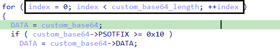

Here like we can see it checks if the chunk size is large it moves the data instead of the pointer to start work...

- First Inner Loop

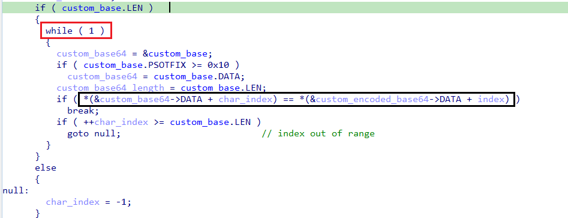

  - Before entering the loop it makes sure the custom base used to encrypt is loaded if yes it enters infinte loop.
We mentioned the malware moves the configs to the `.data` section in run time before the main and this base isn't exception


  - Inside the loop it iterates throw this custom base(characters set differ from the base64 ordinary characters set).
  - The loop searches for the character in the encrypted config inside this custom set and return its index `char_index`.
- Second Inner Loop

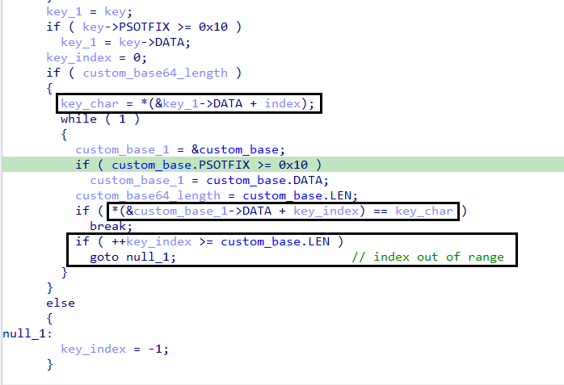

  - The second loop is tybical the previous one but this is searching for the index of a corresponding letter from characters set I called them `Key` which also dynamically moved to the `.data` section before the main.
  
  
  
  - For each character in the encrypted config it has a corresponding character in the key depends on the config's character index`(eg. if there is a character c in the encrypted config its index there is 6 it's corresponding character in the key is 5)`
  - If the config length is greater than the key length it will repeat the process from the beginning of the key.
  - This loop also searches for that specific character and returns its index `key_index`.

- Decrypt
After getting the indexes from the previous two loops the math begin...

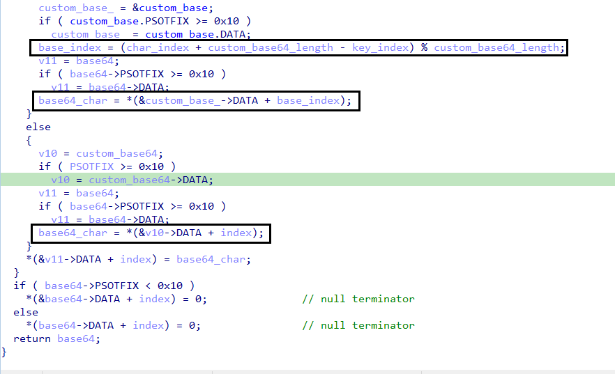
  
  - In this block of code we see it takes the two indexes makes an operation to get the actual index of the actual base64's chcharacters

##### Decode Base64

After the main for loop the retrun value is the actual base64 which we can decode it using base64 libraries or using `cyberchef`

### configs extractor

To get the configs I developed a [python script](./test.py) simulating the decryption process to extract all the configs.

eg. for this algorithm
```
Encoded Base64: N1iP7RPqGrQZXG== //from the executable
Decoded Base64: R3h0dXVtLmV4ZQ== //after applying the previous algorithm
Decoded String --> Gxtuum.exe  //just decode the output base64 
```

#### Decrypted Configs

<details style="color: #EEFFFF; font-family: monospace !default; font-size: 0.85em; background: #263238; border: 1px solid #263238; border-radius: 3px; padding: 10px; line-height: 1.8">
    <summary style="outline: none; cursor: pointer">
        <span style="color: darkgray">
            Expand to see more
        </span><br>
        185.196.8.37<br>
        /Gd85kkjf/index.php<br>
        cca1940fda<br>
        Gxtuum.exe<br>
        </summary>
5.12<br>
S-%lu-<br>
%-lu<br>
-%lu<br>
SOFTWARE\Microsoft\Windows\CurrentVersion\Explorer\User Shell Folders<br>
SOFTWARE\Microsoft\Windows\CurrentVersion\RunOnce<br>
Startup<br>
Rem<br>
cmd /C RMDIR /s/q <br>
SOFTWARE\Microsoft\Windows\CurrentVersion\Run<br>
rundll32 <br>
Programs<br>
SOFTWARE\Microsoft\Windows\CurrentVersion\Explorer\Shell Folders<br>
%USERPROFILE%<br>
\App<br>
POST<br>
GET<br>
id:<br>
vs:<br>
sd:<br>
os:<br>
bi:<br>
ar:<br>
pc:<br>
un:<br>
dm:<br>
av:<br>
lv:<br>
og:<br>
r=<br>
cred.dll|clip.dll|<br>
cred.dll<br>
clip.dll<br>
d1<br>
e1<br>
e2<br>
e3<br>
Main<br>
http://<br>
https://<br>
exe<br>
dll<br>
cmd<br>
ps1<br>
msi<br>
zip<br>
/quiet<br>
<\c><br>
<\d><br>
/Plugins/<br>
&unit=<br>
shell32.dll<br>
kernel32.dll<br>
GetNativeSystemInfo<br>
ProgramData\<br>
AVAST Software<br>
Avira<br>
Kaspersky Lab<br>
ESET<br>
Panda Security<br>
Doctor Web<br>
AVG<br>
360TotalSecurity<br>
Bitdefender<br>
Norton<br>
Sophos<br>
Comodo<br>
WinDefender<br>
0123456789<br>
rb<br>
wb<br>
Content-Type: multipart/form-data; boundary=----------<br>
Content-Disposition: form-data; name="data"; filename="<br>
Content-Type: application/octet-stream<br>
?scr=1<br>
.jpg<br>
Content-Type: application/x-www-form-urlencoded<br>
SYSTEM\CurrentControlSet\Control\ComputerName\ComputerName<br>
ComputerName<br>
abcdefghijklmnopqrstuvwxyz0123456789-_<br>
-unicode-<br>
SYSTEM\CurrentControlSet\Control\UnitedVideo\CONTROL\VIDEO\<br>
SYSTEM\ControlSet001\Services\BasicDisplay\Video<br>
VideoID<br>
\0000<br>
DefaultSettings.XResolution<br>
DefaultSettings.YResolution<br>
SOFTWARE\Microsoft\Windows NT\CurrentVersion<br>
ProductName<br>
2019<br>
2022<br>
2016<br>
2025<br>
CurrentBuild<br>
rundll32.exe<br>
/k <br>
"taskkill /f /im "<br>
" && timeout 1 && del <br>
&& Exit"<br>
" && ren <br>
Powershell.exe<br>
-executionpolicy remotesigned -File "<br>
shutdown -s -t 0<br>
st=s<br>
random<br>
Keyboard Layout\Preload<br>
00000419<br>
00000422<br>
00000423<br>
0000043f<br>
</details>

## C2

Amadey stores the C2 server on its configurations and decrypts it when needed like other configurations.
After Amadey sets up all things, achieve presistence, host profiling, move itself to the temp and boot up from there, it creates a thread to continue the work from an infinte loop...

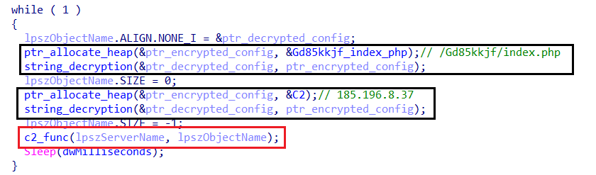

Amadey decryptes the C2 server and the object it will request at the begining of the function.
Things can be very confusing, but Amadey uses stack pointer manipulation which is making things quite difficult especially when it comes to arguments and it's hard to resolve for ida, but I did my best to clear things up.

### C2 Comms

Inside the `c2_func`, it starts to initialize the data for the requests...
Amadey initializes the connection with the remote end using the high level `Wininet.dll` library APIs.


* Initialize the connection


* Read the Data from the server


* Save the data to another variable


* Return the data received from the server

It opens a request to the server and send in the first request the optional data `st=s` to the server and receive the commands...

After every call for `c2_comms`, Amadey checks for the strings `<c>`,`<d>`, and get the values after it, if not found clean stack and move to the second request and like this if there is no response clean every thing and exit the function `c2_func`, sleep and reconnect again.

Amadey uses the first request to get the time the sample should sleep `dwMillisecond` after every time the function `c2_func` exits.

After that, Amadey initialize the second request which contain the gathered data about the system `Host Profiling` encrypted with `rc4`.


After sending these data, the bot recieves the command from the server and save it to select what option to do.
If there is no resopnse from the server like above it will clean everything and sleep for a while and reconnect.

After geting the data from the server, Amadey starts the work.
This function passes the work to `sub_41E5E0` and passes four arguments to it...


- `server_response` where the resopnse from the server is stored.
- `hashtag` where the config `#` is stored to be used inside the function later.
- `_lpszServerName` where the sample stores the server domain `185.196.8.37`.
- `_lpszObjectName` where the sample stores the object to ask the server for which is `/Gd85kkjf/index.php` and all work starts from it.

Amadey starts to search for `#` in the data received from the server...

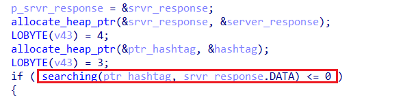

If can't find the `#` inside the data recieved from the server, reallocate the arguments and continue the work from another function `sub_41CAE0`

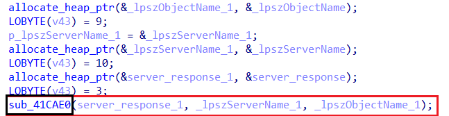

But if found `#` the other path starts with infinte loop and starts to search for the hashtags `#` through the response uses a variable as an index to indicates where is these hashtags and if this counter or index exceeds the total size of the server response the loop break.


The break from the loop resides at the end of the loop...


Because I can't get the response from the server without emulation, I assume that the response `commands` is kind of instructions sequence separated by `#` and we would know why later...

This infinite loop (as appear like I mentioned) takes each instruction separately which starts with `#` and excute it then returns to the loop to the next instruction until the end of the commands, after reach this point the malware cleans every thing and redo every thing again.

Inside the function like we said, it starts to search for hashtags inside the server response...

The way is simple, Amadey starts to allocate each charcater and compare it with `#` and if `yes` the variable `hash_found` is set.


```str_cmp is a sepcial function for string comapring returns`1` if succeeded and `0` if not.```

After locating the hashtag inside the response the malware starts to excute the command after it from the function `sub_14CAE0`...

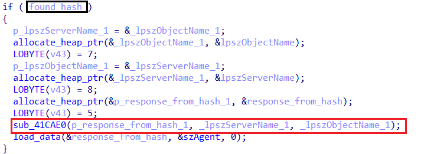

This function starts to look for the number to indicate what option or path to take.


Here, get at most to bytes from a position `+8` from the data recieved from the server.

At the end of the function there is a `switch-case` block consists of 19 cases.

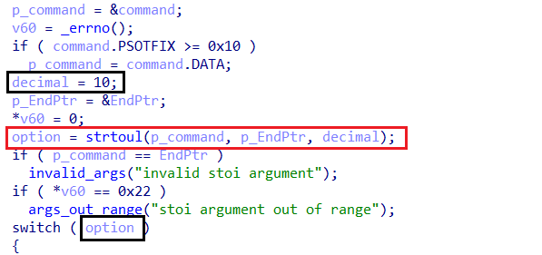

This block of code convert the two or one bytes in `command` variable to integer which decides what option or path to take.

After getting the option from the data received and before deciding which path to take, it tries to search for `+` in the data at a certain position every time `after 0xB`.


Then it starts to check if `+` is found at this position..

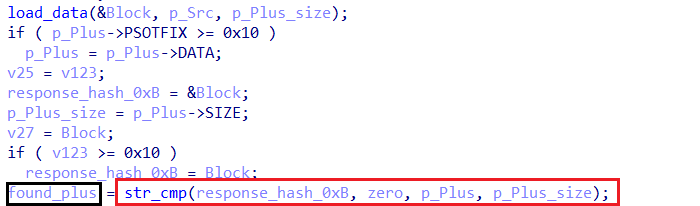

If `yes`, it gets some data from the memory at `hex` format and decrypts it with `rc4`..

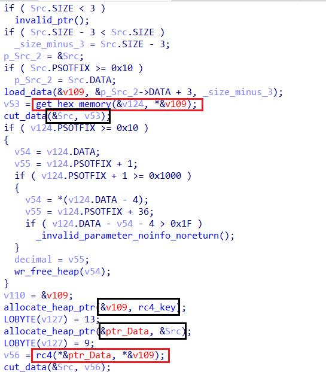

#### Options

Most cases are concerned with droping files into the system at different places

- Cases `10, 12, 26, 27, 28` all takes the same path with different initialzing.
- Cases `23, 22, 21, 20, 29` sending different data
- Case`11` drop `dll`
- Case`13` inject and excute payload from the server
- Case`14` drop another payload
- Case`15` initialize connection with low-leve APIs
- Case`16` use the low-leve connection
- Case`17` drop&excute another payload
- Case`18` sending data and drop another payload
- Case`22` another path in it dropped a `dll` `Plugins.dll`
- Case`24` sending data
- Case`25` another way to creat and drop file

These options clears up that it has many paths to do one thing as a back-up or to do it with different arguments

## payload injection

### Get Payload

The injection process takes place if the option is `13`.
Like always in this sample and the stack pointer manipulation, it reallocates the arguments again before calling the function responsible for the injection.

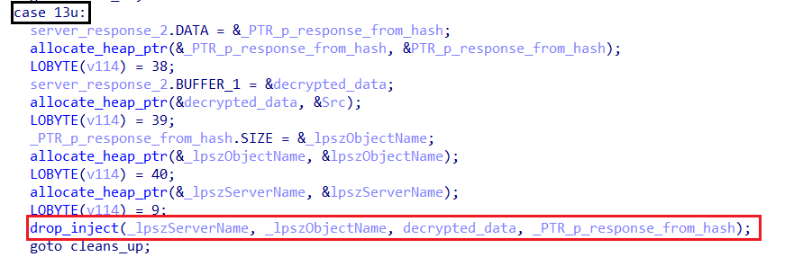

Inside the function `drop_inject`, it initialize a counter with `0` and enters an infinite loop.


It connects to the server and reads file and pass it to the function responsible for injection if the reading process succeeded. If not close handles.


If the malware could read the payload from the server and the `injection` function returns `1`(which is always returns `1`), the loop breaks successfuly.
If the malware can't receive any response from the server which means also the injection process didn't go as planed, the malware sleeps for `10` seconds and go to lable `LABLE_66`


The function `send_data` sends some random data, but known for the mawlare author, which I assume is used to check if the server is up or has been got down.

### Inject Payload


- The function starts to retrieve the file name of the current executable and stores it in `Filename` to create another process of it in the `suspended` state using `CreateProcessA` API.
- At first, it checks if the payload starts with the   magic signature for the pe files `MZ` and if yes it checks if the signature is `PE` to nake sure the payload is an excutable.
- Allocates memory for the thread context and retrieves the thread context of the suspended process,
attempts to read the process memory (likely checking the ImageBase).
- Calls `NtUnmapViewOfSection` to remove the existing executable from the newly created process.
- Allocates memory in the remote process for the new executable image.
- Writes the headers of the new PE file into the target process.
- Iterates over the sections of the PE file and copies each section into the newly allocated memory space.
- Writes the new base address into the process memory and updates the `EAX` register with the new entry point.
- Finally, sets the modified context and resumes execution.
- Then the function returns `1`.


# IOCs
| No                          | Description                                                                      |  Value      |
|--------------------------------|-----------------------------------------------------------------------------|--------------|
| 1 | C2 | `185.196.8.37/Gd85kkjf/index.php` |
|2| Temp Folder| `cca1940fda`|
|3| Running Process| `Gxtuum.exe`|
| 4| Dropped File | `Plugins.dll`, `book.exe`, `Book.xslx`|
|5|Created Job|`Gxtuum.job`|

# yara

# Conclusion

# Xrefs
